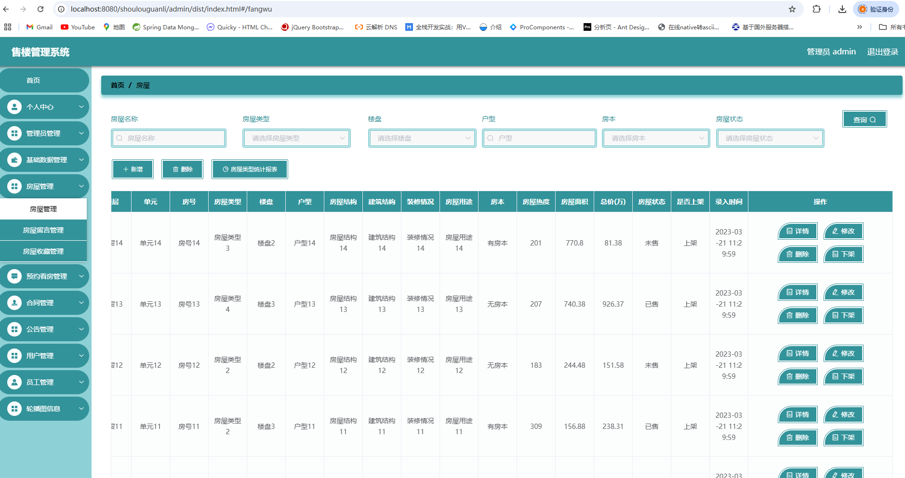

# 一、系统说明

基于springboot+elementui开发的校园闲置物品交易系统,系统功能齐全, 代码简洁易懂，适合小白学编程。

# 二、系统架构

######      前端：vue| elementui

######      后端：springboot | mybatis 

######      环境：jdk1.8+ | mysql8.0 | maven

# 三、代码及数据库

# 四、相关功能介绍

#### 1).客户端

###### 1.登录

###### 2.注册

###### 3.首页

###### 4.房屋

5.公告

###### 6.个人中心

###### 7.个人中心->房屋收藏

###### 8.个人中心->预约看房

###### 9.个人中心->合同

######

###### 2).管理端

###### 1.登录

2.管理员信息

###### 3.个人中心->修改密码

###### 4.基础数据管理

###### 5.房屋管理

包含:新增、详情、删除、下架、新增、房屋报表功能

###### 6.房屋管理->房屋留言管理

包含:详情、删除、回复

###### 7.房屋管理->房屋收藏管理

包含:详情、删除、查询功能

###### 8.预约看房管理

包含:详情、删除、审核功能

###### 9.合同管理

包含:详情、删除、下载功能

###### 10.公告

包含:详情、删除、查询、修改、新增功能

###### 11.用户管理

###### 12.员工管理

包含:详情、删除、修改、重置密码功能

###### 13.轮播图管理

###### 14.员工登录

整体功能与管理员类似

